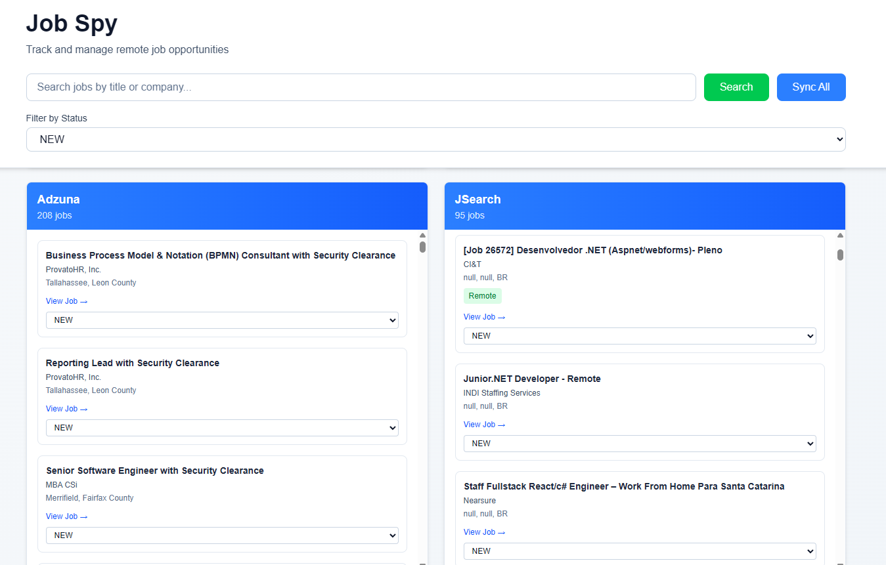

# jobs-spy



A simple job-aggregator built with Next.js + Prisma that collects remote job listings from several public job APIs (Remotive, Arbeitnow, Adzuna, JSearch) and stores them in a MySQL database. The project provides a small frontend, server-side API routes for ingestion and querying, and Prisma models/migrations for persistence.

---

## Tech stack & tools 🔧

- Next.js (App Router) + React + TypeScript
- Prisma ORM (MySQL)
- MySQL (Docker Compose)
- Docker Compose (db + app compose files provided)
- Tailwind / PostCSS (project styling)
- ESLint, TypeScript

---

## Quick overview

- Purpose: aggregate job postings from public sources and serve them via a small UI + internal API.
- Key features: multiple data sources (Remotive, Arbeitnow, Adzuna, JSearch), deduplication, simple job status updates, Prisma schema + migrations.

---

## Getting started — local development

1. Install dependencies

```bash
npm install
```

2. Copy `.env.example` → `.env` and fill required environment variables (do NOT commit `.env`). Important env keys:

- `DATABASE_URL`, `SHADOW_DATABASE_URL`
- `MYSQL_ROOT_PASSWORD`, `MYSQL_DATABASE`, `MYSQL_USER`, `MYSQL_PASSWORD`
- `PMA_BLOWFISH_SECRET`, `PMA_ABSOLUTE_URI`
- `JSEARCH_APP_KEY`, `ADZUNA_APP_ID`, `ADZUNA_APP_KEY`

3. Start the database (recommended):

```bash
# start MySQL + admin tools
docker compose -f docker-compose.db.yml up -d
```

4. Run development server

```bash
npm run dev
# open http://localhost:3000
```

Notes:

- The repository includes `docker-compose.db.yml` (MySQL + phpMyAdmin/adminer). The UI tools (phpMyAdmin and Adminer) are now routed through Traefik — update the placeholder hostnames below to match your DNS/hosts file:
  - phpMyAdmin: `phpmyadmin.example.com`
  - Adminer: `adminer.example.com`
    (to change, edit the `Host(...)` rule in `docker-compose.db.yml` labels)
- `docker-compose.app.yml` contains an `app` service & example Traefik labels (for deployments that use a `traefik_default` network). Use `-f` to combine files when running with Docker Compose.

Example full compose start (builds `app` and uses DB compose):

```bash
docker compose -f docker-compose.db.yml -f docker-compose.app.yml up -d --build
```

(If you use Traefik in production, ensure the external `traefik_default` network exists.)

---

## Database / Prisma

- Migrations are in `prisma/migrations/`.
- Run migrations locally and generate client:

```bash
npx prisma migrate dev
npx prisma generate
npx prisma studio   # visual DB browser
```

For production use `npx prisma migrate deploy`.

---

## API — available endpoints

The app exposes a few internal API routes (see `app/api/*`):

- GET `/api/getjobs?filter=<text>` — return stored jobs (filter by title)
- GET `/api/syncjobs?action=<remotive|arbeitnow|adzuna|jsearch>&filter=<optional>` — fetch jobs from third-party sources and insert new ones into the DB
- POST `/api/updateJobStatus/[jobId]` — update job status (JSON body: `{ "status": "APPLIED" }`)

Example curl:

```bash
# fetch stored jobs
curl "http://localhost:3000/api/getjobs?filter=react"

# trigger sync from Remotive
curl "http://localhost:3000/api/syncjobs?action=remotive&filter=react"

# update job status
curl -X POST -H "Content-Type: application/json" \
  -d '{"status":"APPLIED"}' \
  http://localhost:3000/api/updateJobStatus/123
```

Model summary (Prisma `Job`): `id`, `title`, `company`, `location`, `url`, `status`, `description`, `source`, `salary`, `remote`, `createdAt`, `updatedAt`.

---

## Project structure (highlight)

- `app/` — Next.js app routes + API routes
- `lib/` — helpers (Prisma client, etc.)
- `prisma/` — schema & migrations
- `public/` — static assets (includes `readme.png`)
- `docker-compose.db.yml` / `docker-compose.app.yml` — docker compose definitions
- `types/` — TypeScript types

---

## How to contribute ✨

- Fork the repo and open a PR with a clear description.
- Keep changes small and focused; add tests where applicable.
- Run linters and type-checking before submitting:

```bash
npm run lint
npm run build
```

- Open an issue first for larger changes or feature discussions.

Contribution ideas:

- Add more job sources / parsers
- Add pagination, filtering and advanced search in the UI
- Improve deduplication and source metadata
- Add CI (lint/tests) and deployment manifests

---

## License

This project is provided under the MIT License. See the `LICENSE` file for details (if missing, add an MIT `LICENSE`).

---

## Contact & links

- Project: `jobs-spy` (local demo / research project)
- Questions / issues: open an issue in this repository

---

## Challenges / ideas for visitors 🏆

- Implement automated scheduled syncs (cron) for each source and monitoring/alerting for failures.
- Add user accounts + bookmarking/applying workflow.
- Add server-side caching and pagination for large result sets.

---

If you want, I can also:

- add a `LICENSE` file (MIT),
- add a short `CONTRIBUTING.md`, or
- create a small PR that documents environment variables and Docker usage in more detail.

Feel free to tell me which of these you'd like next.
